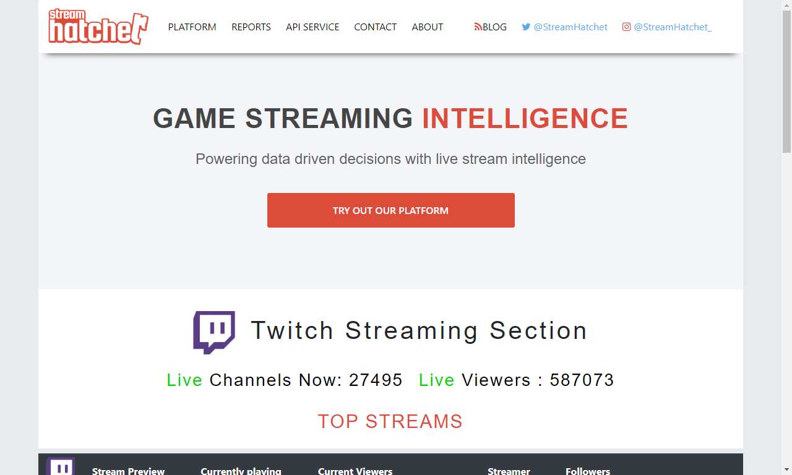
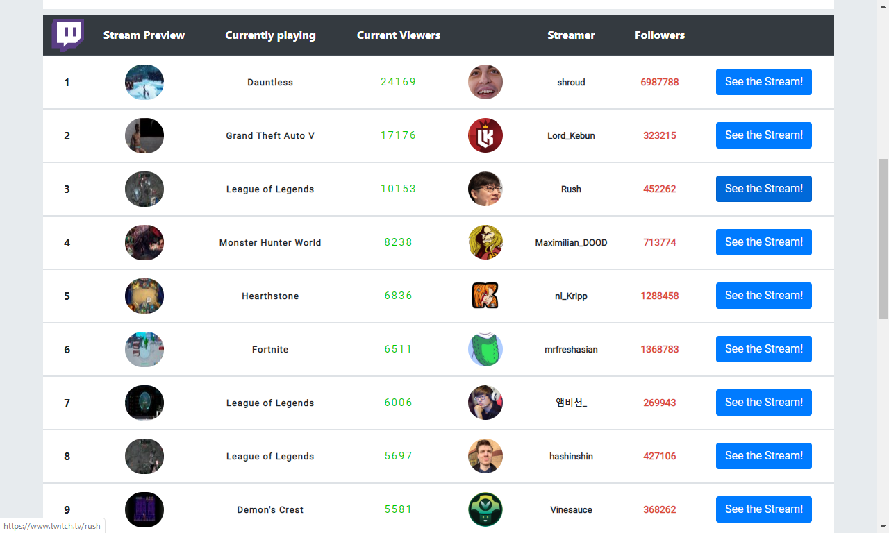
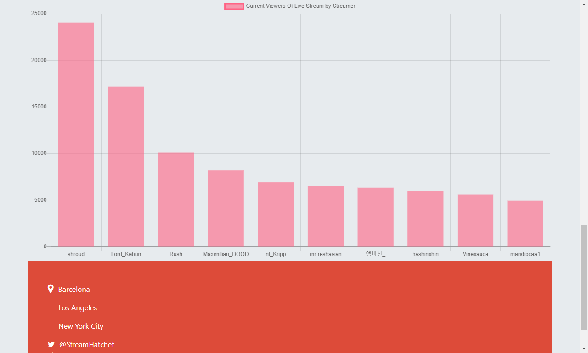
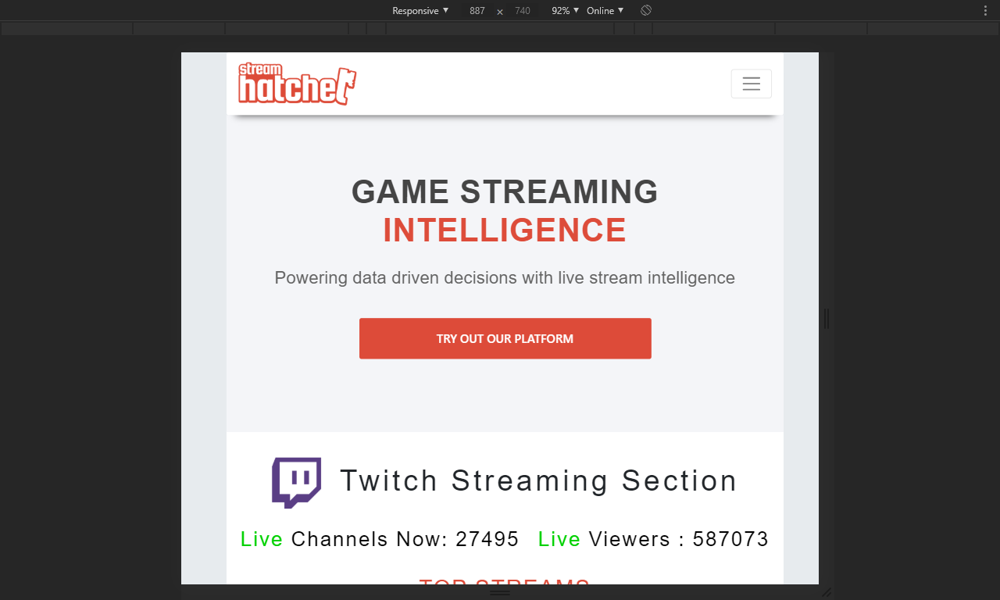
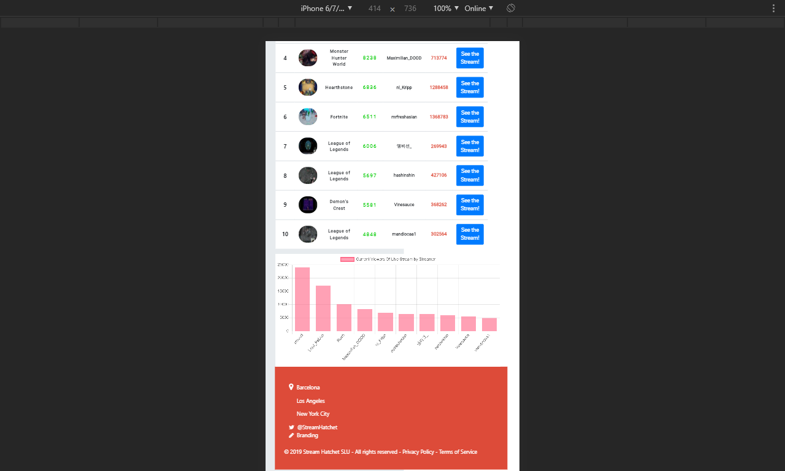
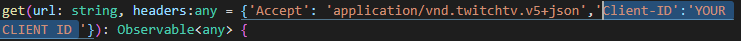

# Twitch Top Streams Viewer

This Project shows the top Live Streams provided by the Twitch API  and the count of live broadcasts and real-time observers, also shows the streamer who is broadcasting , a link to the stream if you want to check it out, and below , a chart with the relation between streamers and the views of the broadcast at that time 

# Preview :

# Architecture

The project has 1 component ( streamer-view-component for the main view), and  1 main service (for making the HTTP calls, managing data and connect with the component).

# Dependencies

- Angular 7
- Bootstrap 4 (uses CDN)
- Chart js
- ng2-charts

# API
You can find all the information about Twitch API here https://dev.twitch.tv/docs/

For fetch the data from the API, that requires an special header with the CLIENT-ID this is given by Twitch ,  you can find it in the Twitch development section : 
https://dev.twitch.tv/console/apps/create

# How to use
- Clone or download the repo
- `cd` into the folder
- After Getting The CLIENT-ID  Header, just modify it in the http call placed in the MAIN SERVICE
  example:

  

- `ng serve` to start developing on port 4200

# Improvements
- add More charts to show more complex information
- dig into the other  different endpoints and display the information for the final user/client

# License

GNU general license.